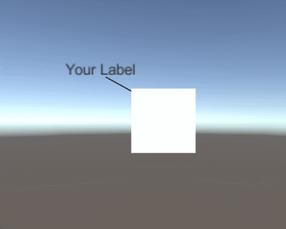
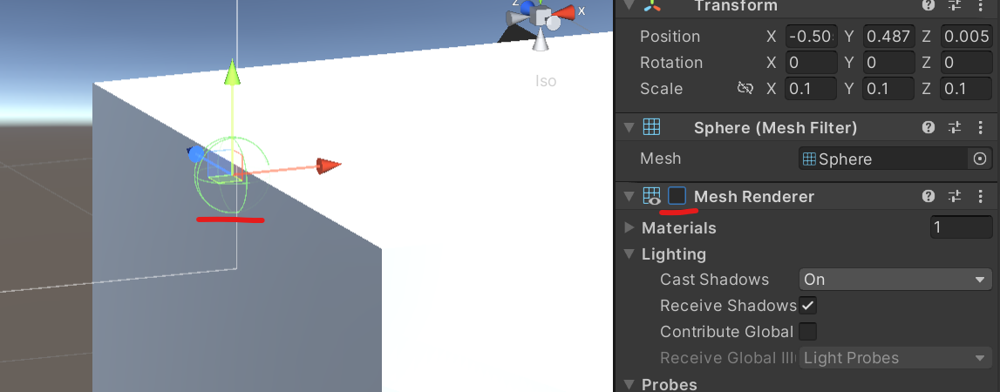

# DynamicLabel3D
 Simple dynamic labels for a 3D Unity scene
 

Labels are always facing towards the main camera. Line renderer is used to draw the line between two positions defined by game objects. To setup the scene, activate the mesh renderer of the Game Objects named `Target` and `Source`. Then you should be able to see two spheres that you can position freely in the scene. The line will be drawn between them.

## Hierarchical Structure
* Cube (Game Object you want to label)
 * Source (Line end pointing towards the cube)
 * Label Canvas (Canvas where the label text is drawn on)
  * Text (Text of the label)
   * Target (Line end pointing towards the label)

## Important Notes
* The cube has a rotation script attached to it so you can rotate it using the mouse (click & drag).
* Deactivate the Mesh Renderer component of Source and Target to hide the spheres after they are placed correctly.
* Make sure Label Canvas has the Dynamic Label script as well as the Line Renderer component attached.
* If you want text with higher resolution I strongly recomment using Text Mesh Pro.
